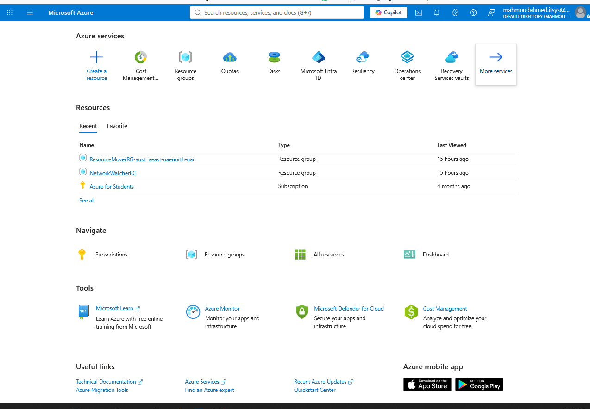
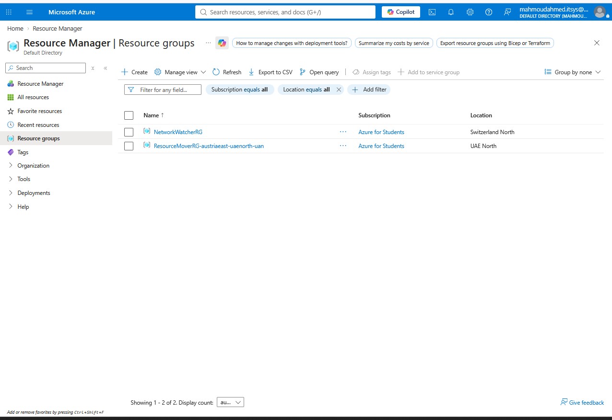
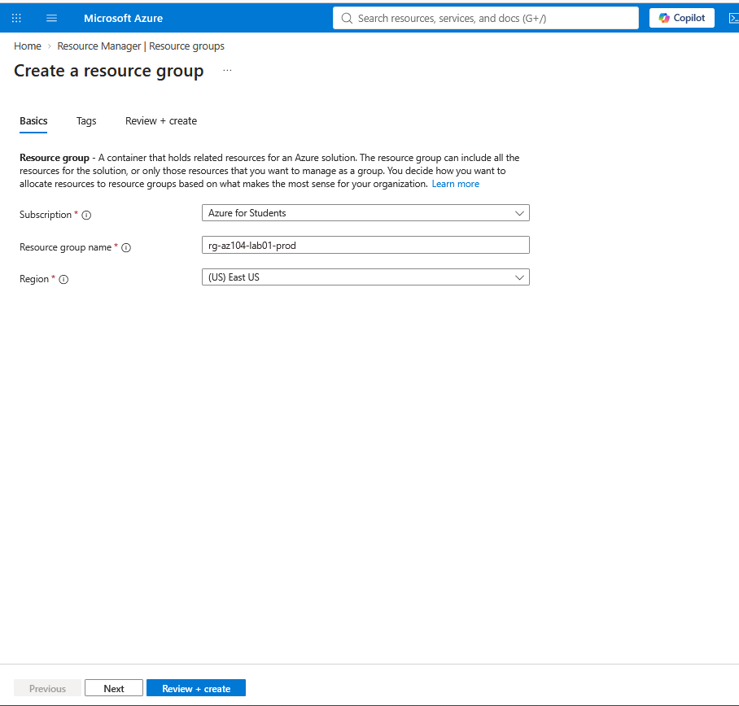
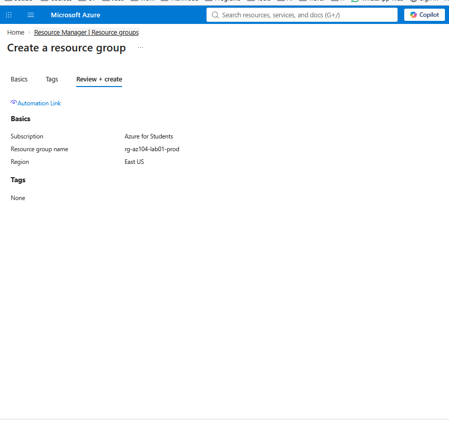
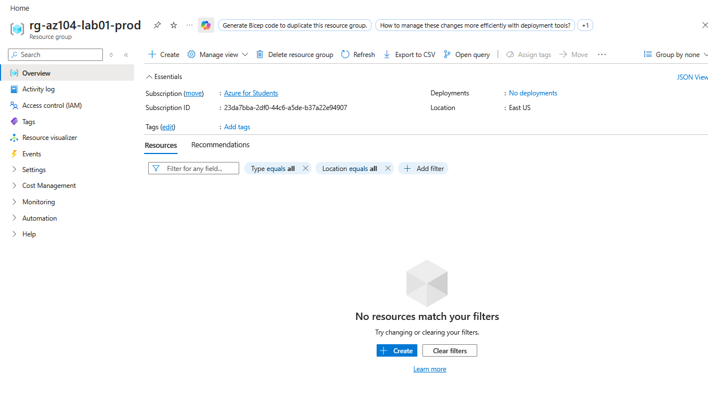
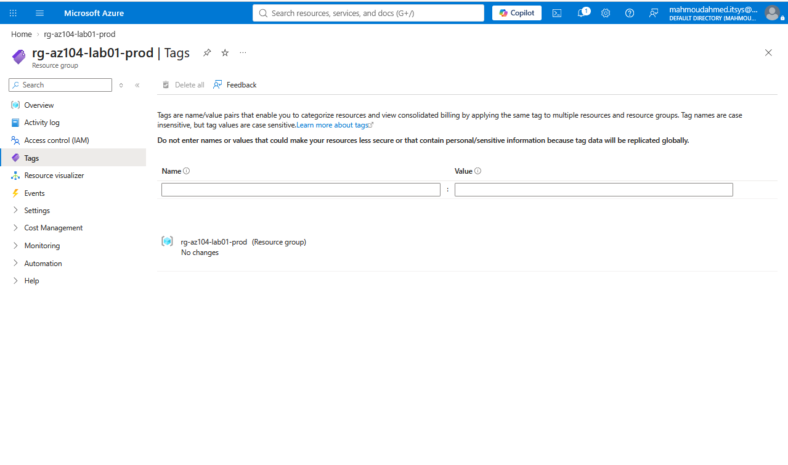
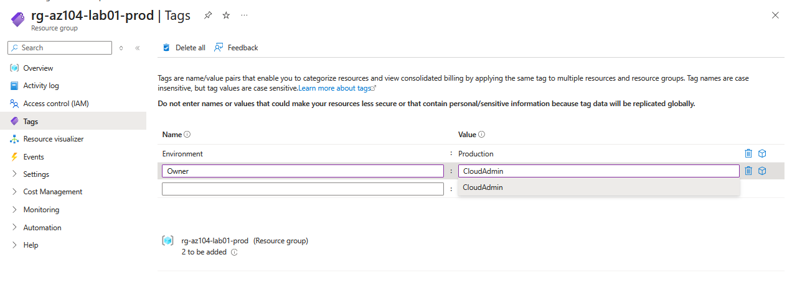
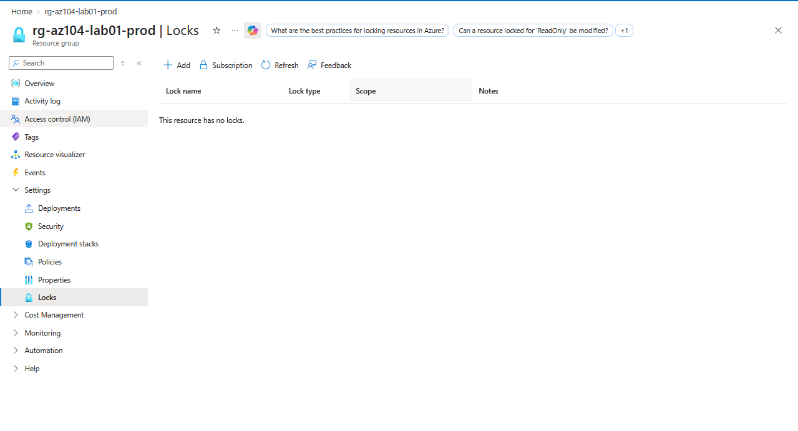
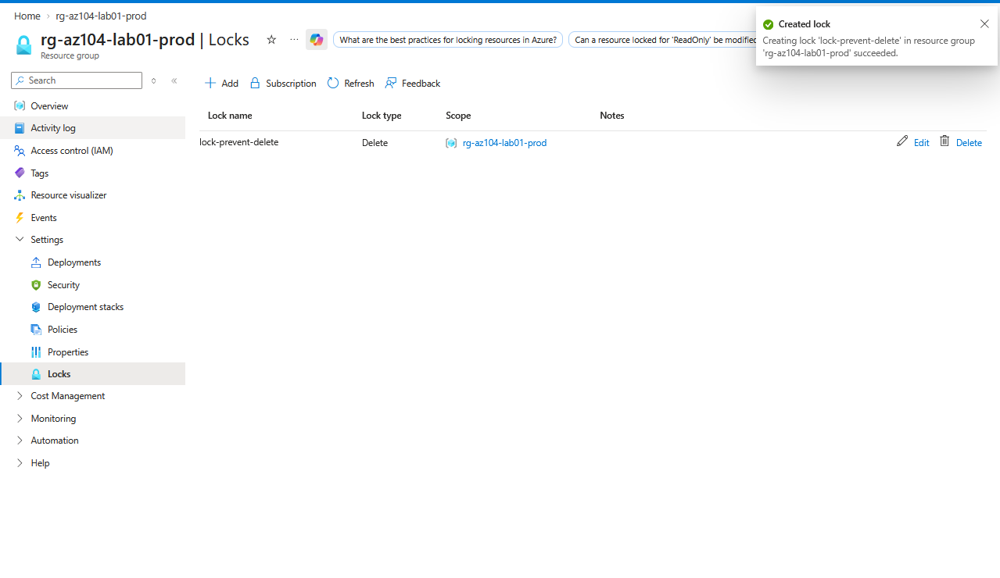

# Lab 01: Azure Resource Hierarchy & Governance Basics

## 💡 Overview & Key Concepts
In Azure, all resources (like Virtual Machines, Storage Accounts, and Databases) must be organized in a structured hierarchy:

- **Management Groups:** Provide scope above subscriptions for enterprise governance.
- **Subscriptions:** An agreement with Microsoft that handles billing and access boundaries.
- **Resource Groups (RG):** A logical container that holds related Azure resources.
- **Tags:** Name/value pairs applied to resources for cost management and tracking.
- **Resource Locks:** Prevents accidental deletion (`CanNotDelete`) or modification (`ReadOnly`).

---

## 🧪 Step-by-Step Hands-On Lab Walkthrough

### Step 1: Open Azure Portal Home
1. Navigate to [portal.azure.com](https://portal.azure.com) and log in.
2. Select **Resource groups** from the Azure services dashboard or search bar.



---

### Step 2: Navigate to Resource Groups
1. Inside the **Resource Manager | Resource groups** view, click **+ Create** at the top left.



---

### Step 3: Configure Basic Settings
1. Select your target **Subscription** (e.g., *Azure for Students*).
2. Enter the **Resource group name**: `rg-az104-lab01-prod`.
3. Choose your **Region**: `(US) East US`.
4. Click **Review + create**.



---

### Step 4: Validate and Create
1. Review the configuration parameters.
2. Click **Create** to deploy the resource group.



---

### Step 5: Open Resource Group Overview
1. Navigate to the newly deployed resource group `rg-az104-lab01-prod`.
2. Confirm the subscription, region, and initial empty resource list.



---

### Step 6: Navigate to Tags Configuration
1. In the left navigation menu under `rg-az104-lab01-prod`, click **Tags**.



---

### Step 7: Apply Resource Group Tags
1. Add Tag 1: Name = `Environment`, Value = `Production`.
2. Add Tag 2: Name = `Owner`, Value = `CloudAdmin`.
3. Click **Apply**.



---

### Step 8: Navigate to Locks Settings
1. In the left navigation menu under **Settings**, select **Locks**.
2. Verify that no locks currently exist on the resource group.



---

### Step 9: Create Resource Delete Lock
1. Click **+ Add**.
2. Configure Lock Name: `lock-prevent-delete`.
3. Set Lock Type: `Delete`.
4. Click **OK**.
5. Verify the notification popup confirming **"Creating lock 'lock-prevent-delete' in resource group 'rg-az104-lab01-prod' succeeded."**



---

## 💻 Commands Reference

### Azure CLI
```bash
# Create Resource Group
az group create --name rg-az104-lab01-prod --location eastus --tags Environment=Production Owner=CloudAdmin

# Apply a Delete Lock to the Resource Group
az lock create --name lock-prevent-delete --resource-group rg-az104-lab01-prod --lock-type CanNotDelete
````

### Azure PowerShell
```powershell
# Create Resource Group
New-AzResourceGroup -Name "rg-az104-lab01-prod" -Location "EastUS" -Tag @{Environment="Production"; Owner="CloudAdmin"}

# Apply Delete Lock
New-AzResourceLock -LockName "lock-prevent-delete" -LockLevel CanNotDelete -ResourceGroupName "rg-az104-lab01-prod"
```
